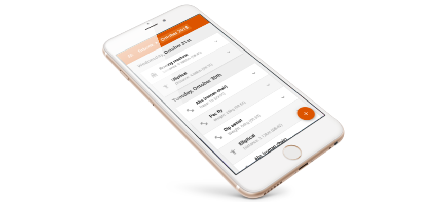

# Fitbook 🏅

Gym tracker with Dropbox storage.

* [Usage](#usage)
* [Local installation](#local-installation)
* [Adding workout types](#adding-workout-types)
* [Build and deployment](#build-and-deployment)

## Usage

- Navigate to https://fitbook.satge.me/
- Login with Dropbox
  - _The app will ask for write permissions in the app folder_
- Save workouts on the go
  - _Data will be saved in `Dropbox/Applications/fitbook/logs`_

## Local installation

```shell
# Make sure node 16 is installed
node -v
# Clone the project
git clone git@github.com:johansatge/fitbook.git
cd fitbook
# Install dependencies
npm install
# Create env file with a Dropbox API key (with "localhost:4000" as allowed URL)
echo "module.exports = { FITBOOK_DROPBOX_APP_KEY: 'xxx' }" > .env.js
# Run the local server (will rebuild app on changes)
npm run watch
# Navigate to http://localhost:4000/
```

## Adding workout types

Workout types are stored in `app/config/workouts.json`. Example:

```json
"rowing": {
  "name": "Rowing machine",
  "icon": "directions_boat",
  "fields": [
    "datetime",
    "duration",
    "distance"
  ],
  "highlight": "distance"
}
```

Field types are stored in `app/config/fields.json`. Example:

```json
"distance": {
  "name": "Distance",
  "type": "number",
  "unit": "km",
  "icon": "map"
}
```

Available icons are visible in `app/icons` ([Material Symbols](https://fonts.google.com/icons)).

## Build and deployment

To test the build locally, run:

```shell
npm run build
```

Assets are built in `.dist`.

Deployment is handled by [Netlify](https://www.netlify.com/), when pushing updates on `master`.
